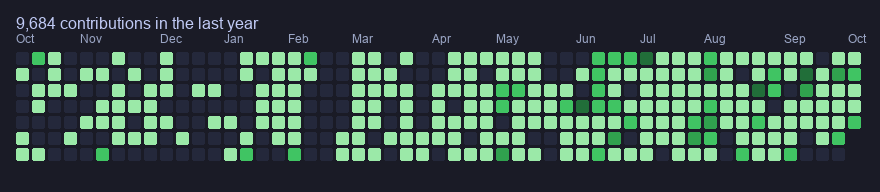
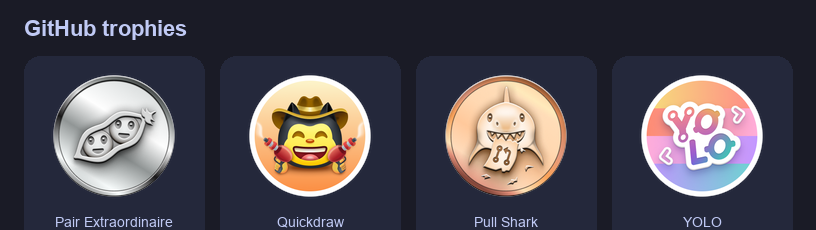

**Uganda · UTC+3** · Available for remote full-time and contract roles

---

## Profile

I am a full-stack and AI engineer and a data analyst. I build web applications, mobile applications, and backend services for education, finance, traceability, sports, and media.

I am a hardware student, and I am studying cybersecurity.

Primary languages: **TypeScript**, **Python**, and **Go**. I also ship with **Kotlin**, **Swift**, and **Flutter**.

| Area | Focus |
| --- | --- |
| Software | Web, mobile, and API development |
| Data | Analysis and reporting |
| Hardware | Coursework and practical study |
| Security | Cybersecurity, currently in progress |

---

## Technical skills

**Languages**

**Frameworks and platforms**

---

## Activity

  
  

  

  

  

---

## Availability

| | |
| --- | --- |
| **Status** | Open to full-time and contract work |
| **Location** | Uganda, remote worldwide |
| **Timezone** | UTC+3 |
| **Email** | [olaropetercelestine@gmail.com](mailto:olaropetercelestine@gmail.com) |
| **Portfolio** | [olaropetercelestine.com](https://www.olaropetercelestine.com) |
